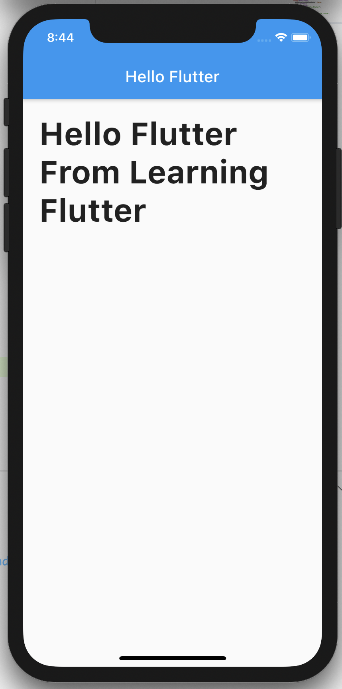
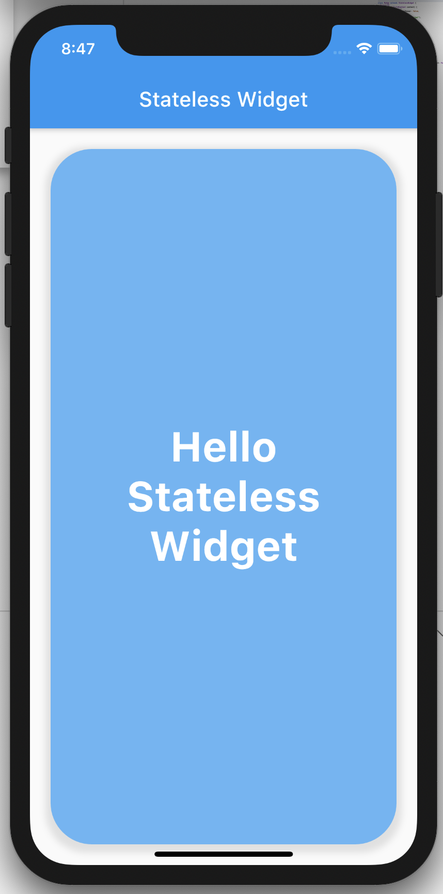
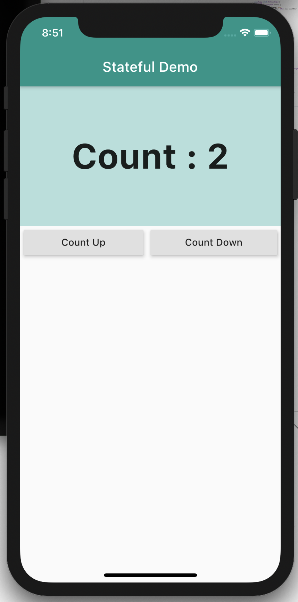

# Basic of Flutter

ဒီနေရာကတော့ အခြေခံသိသင့်သိထိုက်တာတွေကို စမ်းသပ်ထားတဲ့ နေရာဖြစ်ပါတယ်။ အခြေခံတွေဖြစ်ကြတဲ့ Stateless Widget, Stateful Widget, Inherited Widget ဒါတွေကို ဒီနေရာမှာလေ့လာသွားမှာဖြစ်ပါတယ်။

တဖန် Flutter မှာ Layout Widget တွေရှိိကြပါတယ်။ UI ကို ရေးသားတဲ့ နေရာမှာ Layout ဆိုတာလဲ မရှိမဖြစ် အရေးပါတဲ့ အချက်တစ်ခုဖြစ်ပါတယ်။ ဒီနေရာမှာ ဒါတွေကို လေ့လာသွားမှာ ဖြစ်ပါတယ်။

Flutter ရဲ့ Basice of the basic တွေကို ဒီနေရာမှာ လေ့လာသွားမှာ ဖြစ်ပါတယ်။

<table style="width=100%">
  <tr>
    <td style="vertical-align:top: text-align: center;">
      <h4>1. Hello Fluter</h4>
      
    </td>
    <td style="vertical-align:top: text-align: center;">
      <h4>2. Stateless Widgets</h4>
      
    </td>
    <td style="vertical-align:top: text-align: center;">
      <h4>3. Statefull Widgets</h4>
      
    </td>
  </tr>
</table>
