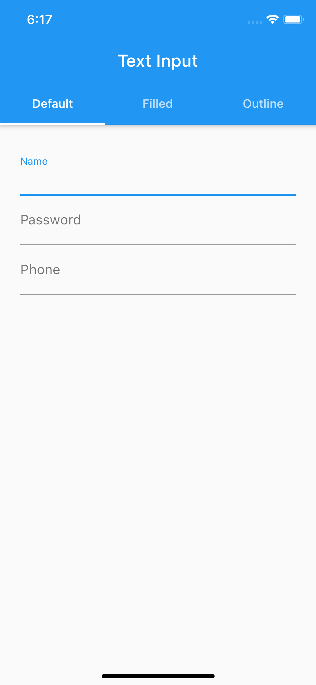
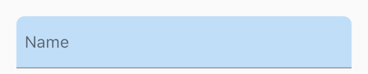
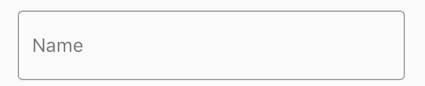

# Text Input Field

User Input တွေကိုလက်ခံဖို့ အဓိက Widget တစ်ခုကတော့ TextFormField ဖြစ်ပါတယ်။ ဒီနေရာမှာတော့ TextFormField တွေရဲ့ Style ကို ဘယ်လို Customize လုပ်မယ်ဆိိုတာကို လေ့လာသွားကြပါမယ်။ 

<table>
  <tr>
    <td>
      <h3>Basic<h3>
      
    </td>
    <td>
      <h3>Filled<h3>
      
    </td>
    <td>
      <h3>Outline<h3>
      
    </td>
  </tr>
</table>

## Basic Input Field

```
class BasicInput extends StatelessWidget {
  final String label;
  final TextInputType inputType;
  final bool hidePass;
  const BasicInput(
      {Key key,
      @required this.label,
      this.inputType = TextInputType.name,
      this.hidePass = false})
      : super(key: key);

  @override
  Widget build(BuildContext context) {
    return TextFormField(
      decoration: InputDecoration(labelText: label),
      keyboardType: inputType,
      obscureText: hidePass,
    );
  }
}
```

## Filled Box Input Field

```
class FilledBoxInput extends StatelessWidget {
  final String label;
  final TextInputType inputType;
  final bool hidePass;
  final Color filledColor;
  final double borderRadius;

  const FilledBoxInput({
    Key key,
    @required this.label,
    @required this.filledColor,
    this.borderRadius = 8,
    this.inputType = TextInputType.name,
    this.hidePass = false,
  }) : super(key: key);

  @override
  Widget build(BuildContext context) {
    return Container(
      margin: EdgeInsets.only(bottom: 8),
      decoration: BoxDecoration(
        color: filledColor,
        borderRadius: BorderRadius.only(
          topLeft: Radius.circular(borderRadius),
          topRight: Radius.circular(borderRadius),
        ),
      ),
      child: TextFormField(
        decoration: InputDecoration(
          labelText: label,
          contentPadding: EdgeInsets.all(8),
        ),
        keyboardType: TextInputType.name,
        obscureText: hidePass,
      ),
    );
  }
}
```

## Outline Box Input Field

```
class OutlineBoxInput extends StatelessWidget {
  final String label;
  final TextInputType inputType;
  final bool hidePass;

  const OutlineBoxInput({
    Key key,
    @required this.label,
    this.inputType = TextInputType.name,
    this.hidePass = false,
  }) : super(key: key);

  @override
  Widget build(BuildContext context) {
    return Container(
      margin: EdgeInsets.only(bottom: 8),
      child: TextFormField(
        decoration: InputDecoration(
          labelText: label,
          border: OutlineInputBorder(),
        ),
        keyboardType: inputType,
        obscureText: hidePass,
      ),
    );
  }
}
```
