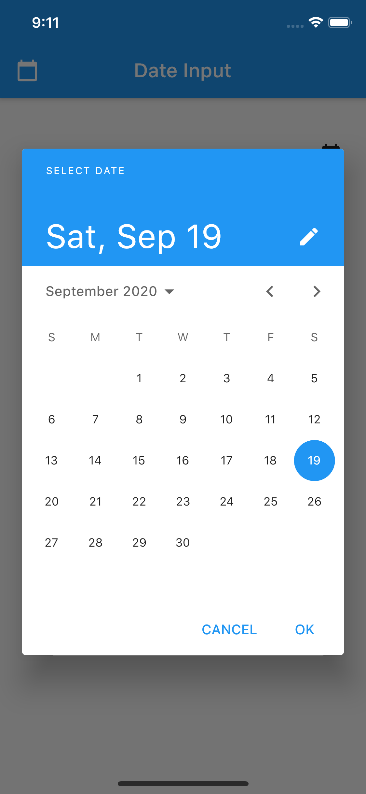
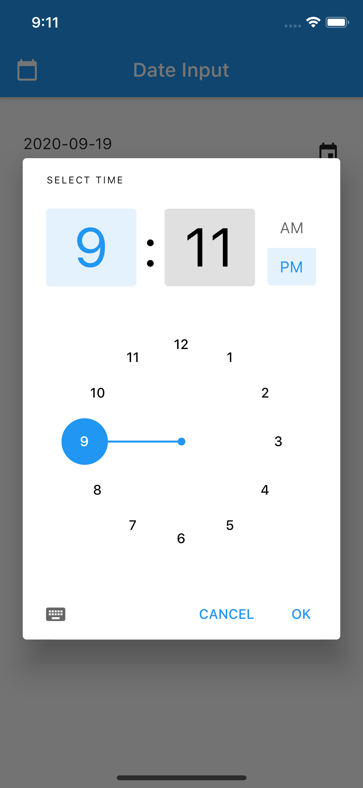
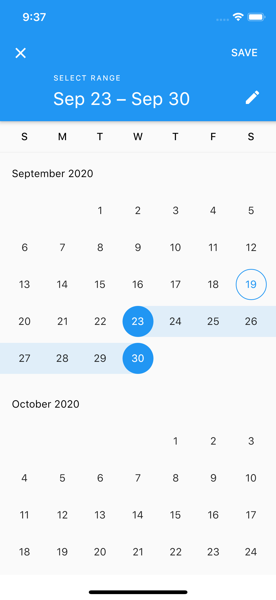

# Date Time Input Fields

User Input တွေကိုလက်ခံဖို့ အဓိက Widget တစ်ခုကတော့ TextFormField ဖြစ်ပါတယ်။ ဒီနေရာမှာတော့ TextFormField တွေရဲ့ Style ကို ဘယ်လို Customize လုပ်မယ်ဆိိုတာကို လေ့လာသွားကြပါမယ်။ 

<table>
  <tr>
    <td>
      <h3>Date Input<h3>
      
    </td>
    <td>
      <h3>Time Input<h3>
      
    </td>
    <td>
      <h3>Date Ranges<h3>
      
    </td>
  </tr>
</table>

## Date Input

```
class DateInputField extends StatefulWidget {
  @override
  _DateInputFieldState createState() => _DateInputFieldState();
}

class _DateInputFieldState extends State<DateInputField> {
  TextEditingController _value = TextEditingController();
  final DateFormat _dateFormat = DateFormat('yyyy-MM-dd');

  @override
  Widget build(BuildContext context) {
    return Row(
      children: [
        Expanded(
          child: TextField(
            enabled: false,
            controller: _value,
          ),
        ),
        GestureDetector(
          onTap: _setDate,
          child: Padding(
            padding: const EdgeInsets.only(top: 20),
            child: Icon(Icons.event),
          ),
        ),
      ],
    );
  }

  _setDate() async {
    DateTime target = (null == _value.text || _value.text.isEmpty)
        ? DateTime.now()
        : _dateFormat.parse(_value.text);

    DateTime selected = await showDatePicker(
        context: context,
        initialDate: target,
        firstDate: DateTime(1990),
        lastDate: DateTime(2030));

    if (null != selected) {
      setState(() {
        _value.text = _dateFormat.format(selected);
      });
    }
  }
}
```

## Time Input

```
class TimeInputField extends StatefulWidget {
  @override
  _TimeInputFieldState createState() => _TimeInputFieldState();
}

class _TimeInputFieldState extends State<TimeInputField> {
  TextEditingController _value = TextEditingController();

  @override
  Widget build(BuildContext context) {
    return Row(
      children: [
        Expanded(
          child: TextField(
            enabled: false,
            controller: _value,
          ),
        ),
        GestureDetector(
          onTap: _setTime,
          child: Padding(
            padding: const EdgeInsets.only(top: 20),
            child: Icon(Icons.schedule),
          ),
        ),
      ],
    );
  }

  _setTime() async {
    TimeOfDay time =
        await showTimePicker(context: context, initialTime: TimeOfDay.now());

    if (null != time) {
      setState(() {
        _value.text = time.format(context);
      });
    }
  }
}
```

## Date Range Input

```
class DateRangeInputFields extends StatefulWidget {
  @override
  _DateRangeInputFieldsState createState() => _DateRangeInputFieldsState();
}

class _DateRangeInputFieldsState extends State<DateRangeInputFields> {
  TextEditingController _value = TextEditingController();
  final DateFormat _dateFormat = DateFormat('yyyy-MM-dd');

  @override
  Widget build(BuildContext context) {
    return Row(
      children: [
        Expanded(
          child: TextField(
            enabled: false,
            controller: _value,
          ),
        ),
        GestureDetector(
          onTap: _setDate,
          child: Padding(
            padding: const EdgeInsets.only(top: 20),
            child: Icon(Icons.event),
          ),
        ),
      ],
    );
  }

  _setDate() async {
    DateTimeRange range = await showDateRangePicker(
      context: context,
      firstDate: DateTime(1990),
      lastDate: DateTime(2030),
    );

    if (null != range) {
      setState(() {
        _value.text =
            "${_dateFormat.format(range.start)} to ${_dateFormat.format(range.end)}";
      });
    }
  }
}
```